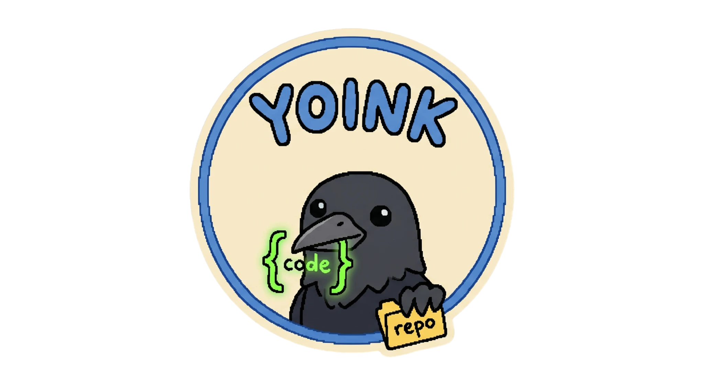

<p align="center">
  
</p>

<h1 align="center">Yoink</h1>

<p align="center">
  <a href="https://github.com/Asifdotexe/yoink/actions/workflows/ci.yml"></a>
  <a href="LICENSE"></a>
</p>

Yoink is a command-line tool and FastAPI backend designed to bundle, sanitize, and visualize codebases for Large Language Model (LLM) contexts. It converts raw project directories into structured Markdown documents, optimizing token consumption and preventing compliance and security leaks.

---

## Key Features

*   **Smart Directory Scanner:** Recursively traverses paths while respecting `.gitignore` rules and custom exclude patterns.
*   **Token Shredder:** Strips comments, docstrings, and excess whitespaces to reduce prompt token sizes by up to 50%.
*   **Secret Shield:** Programmatically identifies and masks API keys, AWS credentials, private keys, emails, and IP addresses.
*   **IP and Compliance Stripper:** Replaces proprietary company URLs, trademarks, and legal entities with generic descriptors based on configurable patterns.
*   **Dependency Tree Visualizer:** Constructs Abstract Syntax Trees (AST) and import patterns to output structural ASCII diagrams and Mermaid flowcharts.
*   **Dual Interface:** Provides a terminal command-line interface (`yoink`) and a RESTful backend API.

---

## Directory Structure

```text
yoink/
├── .github/
│   └── workflows/         <- CI/CD testing pipeline
├── docs/                  <- CLI and API usage guides
├── src/
│   └── yoink/             <- Main package directory
│       ├── core/          <- Business logic (scanner, shredder, shield, packer)
│       ├── cli/           <- Terminal command interface
│       └── api/           <- FastAPI web routes and service
├── tests/                 <- Core, CLI, and API unit tests
├── .yoinkconfig.json      <- Default configuration template
├── pyproject.toml         <- Modern package configuration
└── README.md              <- Project documentation
```

---

## Installation

The package is published on PyPI as `yoinky`, but the command-line interface command remains `yoink`.

Install from PyPI:
```bash
pip install yoinky
```

Or install locally in editable mode:
```bash
# Clone the repository
git clone https://github.com/Asifdotexe/yoink.git
cd yoink

# Install the package
pip install -e .

# Or install with test dependencies
pip install -e ".[test]"
```

---

## Usage

### 1. Command Line Interface

Run the `yoink` command in the directory you wish to pack:

```bash
yoink [path] [flags]
```

#### Flags and Arguments

| Flag | Short | Description |
| :--- | :--- | :--- |
| `path` | | Path to the directory or file to pack (default: current directory). |
| `-o`, `--output` | | Output file path (default: `yoink_output.md` or `-` for stdout). |
| `-c`, `--config` | | Path to custom configuration file. |
| `--exclude-tests` | | Exclude test files and test directories from scanning. |
| `--raw` | | Disables all processing (comment, whitespace, secret, compliance, dependency trees) and packs files exactly as they are. |

#### Examples

Pack the current directory with default cleaning settings:
```bash
yoink
```

Pack a project folder and output to standard output:
```bash
yoink /path/to/project -o -
```

Pack raw codebase contents while skipping test folders:
```bash
yoink . --raw --exclude-tests
```

---

### 2. REST API Web Server

Start the API server using Uvicorn:

```bash
python -m uvicorn yoink.api.main:app --reload
```

Interactive OpenAPI documentation is available at `http://localhost:8000/docs`.

#### Endpoints

*   `POST /api/v1/sanitize`: Cleans and sanitizes a single raw code fragment payload.
*   `POST /api/v1/pack`: Takes a list of file paths and contents directly to assemble them into a packed Markdown payload.
*   `POST /api/v1/pack-zip`: Accepts an uploaded ZIP file of a project and runs the packer remotely, automatically reading any `.yoinkconfig.json` configuration inside the archive.

---

## Configuration (`.yoinkconfig.json`)

To customize cleaning behavior, place a `.yoinkconfig.json` in your project root directory:

```json
{
  "exclude_patterns": [
    "**/__pycache__/**",
    "**/.git/**",
    "**/.venv/**"
  ],
  "include_extensions": [
    ".py",
    ".js",
    ".ts",
    ".go"
  ],
  "secret_patterns": {
    "ip_address": "\\b(?:(?:25[0-5]|2[0-4][0-9]|[01]?[0-9][0-9]?)\\.){3}(?:25[0-5]|2[0-4][0-9]|[01]?[0-9][0-9]?)\\b",
    "generic_api_key": "(?:key|api|secret|token|password|passwd|auth)_?(?:key|api|secret|token|password|passwd|auth)?\\s*[:=]\\s*['\"][a-zA-Z0-9_\\-]{16,}['\"]"
  },
  "compliance_patterns": {
    "\\b[a-zA-Z0-9.-]+\\.internal\\.net\\b": "[PROPRIETARY_ENDPOINT]",
    "\\bYoinkCorp\\b": "[COMPANY_NAME]",
    "\\bConfidentialProprietaryLogicID\\b": "[PROPRIETARY_ID]"
  },
  "strip_comments": true,
  "strip_whitespace": true,
  "mask_secrets": true,
  "visualize": true,
  "output_file": "yoink_output.md"
}
```

---

## Running Tests

Verify your installation by running the test suite:

```bash
pytest
```

---

## License

This project is licensed under the GNU AGPLv3 License.
