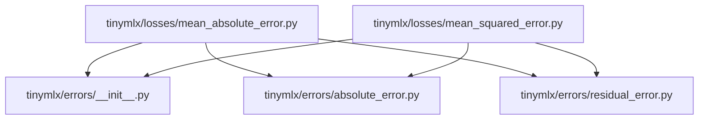

# YP
- Gen: 2026-06-17T18:48:12.546680
- Dir: D:/forked/tinyMLx
- Files: 52
- Tokens: 12,737

[Legend: YP=Yoink Pack, FL=File List, DT=Dependency Tree, VG=Visual Graph, SF=Start File, EF=End File]

## FL
- `.github/workflows/deploy-docs.yml`
- `docs/api/lossfunc/absolute_error.md`
- `docs/api/lossfunc/squared_error.md`
- `docs/api/models/linear_regression.md`
- `docs/api/models/logistic_regression.md`
- `docs/index.md`
- `docs/philosophy.md`
- `docs/recipes/manual_gradient_descent.md`
- `docs/theory/calculus_mapping.md`
- `mkdocs.yml`
- `pyproject.toml`
- `README.md`
- `requirements.txt`
- `tests/__init__.py`
- `tests/test_activations/__init__.py`
- `tests/test_activations/test_sigmoid.py`
- `tests/test_datasets/__init__.py`
- `tests/test_linalg/__init__.py`
- `tests/test_linalg/test_matmul.py`
- `tests/test_lossfunc/__init__.py`
- `tests/test_lossfunc/test_absolute_error.py`
- `tests/test_lossfunc/test_squared_error.py`
- `tests/test_metrics/__init__.py`
- `tests/test_models/__init__.py`
- `tests/test_models/test_linear_regression.py`
- `tests/test_models/test_logistic_regression.py`
- `tests/test_preprocessing/__init__.py`
- `tinymlx/__init__.py`
- `tinymlx/_utils.py`
- `tinymlx/activations/__init__.py`
- `tinymlx/activations/linear.py`
- `tinymlx/activations/sigmoid.py`
- `tinymlx/datasets/__init__.py`
- `tinymlx/errors/__init__.py`
- `tinymlx/errors/absolute_error.py`
- `tinymlx/errors/residual_error.py`
- `tinymlx/extras/__init__.py`
- `tinymlx/extras/visualize.py`
- `tinymlx/helpers.py`
- `tinymlx/linalg/__init__.py`
- `tinymlx/linalg/matmul.py`
- `tinymlx/linearmodel/__init__.py`
- `tinymlx/linearmodel/linear_regression.py`
- `tinymlx/linearmodel/logistic_regression.py`
- `tinymlx/losses/__init__.py`
- `tinymlx/losses/mean_absolute_error.py`
- `tinymlx/losses/mean_squared_error.py`
- `tinymlx/lossfunc/__init__.py`
- `tinymlx/lossfunc/signed_error.py`
- `tinymlx/lossfunc/squared_error.py`
- `tinymlx/metrics/__init__.py`
- `tinymlx/preprocessing/__init__.py`

## DT
```
Dependency Tree:
├── .github/workflows/deploy-docs.yml
├── README.md
├── docs/api/lossfunc/absolute_error.md
├── docs/api/lossfunc/squared_error.md
├── docs/api/models/linear_regression.md
├── docs/api/models/logistic_regression.md
├── docs/index.md
├── docs/philosophy.md
├── docs/recipes/manual_gradient_descent.md
├── docs/theory/calculus_mapping.md
├── mkdocs.yml
├── pyproject.toml
├── requirements.txt
├── tests/__init__.py
├── tests/test_activations/__init__.py
├── tests/test_activations/test_sigmoid.py
├── tests/test_datasets/__init__.py
├── tests/test_linalg/__init__.py
├── tests/test_linalg/test_matmul.py
├── tests/test_lossfunc/__init__.py
├── tests/test_lossfunc/test_absolute_error.py
├── tests/test_lossfunc/test_squared_error.py
├── tests/test_metrics/__init__.py
├── tests/test_models/__init__.py
├── tests/test_models/test_linear_regression.py
├── tests/test_models/test_logistic_regression.py
├── tests/test_preprocessing/__init__.py
├── tinymlx/__init__.py
├── tinymlx/_utils.py
├── tinymlx/activations/__init__.py
├── tinymlx/activations/linear.py
├── tinymlx/activations/sigmoid.py
├── tinymlx/datasets/__init__.py
├── tinymlx/extras/__init__.py
├── tinymlx/extras/visualize.py
├── tinymlx/helpers.py
├── tinymlx/linalg/__init__.py
├── tinymlx/linalg/matmul.py
├── tinymlx/linearmodel/__init__.py
├── tinymlx/linearmodel/linear_regression.py
├── tinymlx/linearmodel/logistic_regression.py
├── tinymlx/losses/__init__.py
├── tinymlx/losses/mean_absolute_error.py
│   ├── tinymlx/errors/__init__.py
│   ├── tinymlx/errors/absolute_error.py
│   └── tinymlx/errors/residual_error.py
├── tinymlx/losses/mean_squared_error.py
│   ├── tinymlx/errors/__init__.py
│   ├── tinymlx/errors/absolute_error.py
│   └── tinymlx/errors/residual_error.py
├── tinymlx/lossfunc/__init__.py
├── tinymlx/lossfunc/signed_error.py
├── tinymlx/lossfunc/squared_error.py
├── tinymlx/metrics/__init__.py
└── tinymlx/preprocessing/__init__.py
```

## VG


#SF:.github/workflows/deploy-docs.yml
```yml
name: Deploy docs to GitHub Pages
on:
  push:
    branches: [main]
    paths:
      - "docs/**"
      - "mkdocs.yml"
permissions:
  contents: write
jobs:
  deploy:
    runs-on: ubuntu-latest
    steps:
      - uses: actions/checkout@v4
      - uses: actions/setup-python@v5
        with:
          python-version: "3.13"
      - run: pip install mkdocs-material
      - run: mkdocs gh-deploy --force
```
#EF:.github/workflows/deploy-docs.yml

#SF:docs/api/lossfunc/absolute_error.md
```md
# AbsoluteError
**Module:** `tinymlx.lossfunc.AbsoluteError`
The element-wise absolute error loss: $L_i = |y_i - \hat{y}_i|$. Also known as L1 loss. Callable via the class instance.
---
## Mathematical Contract
| Phase | Method | Signature | Formula |
|-------|--------|-----------|---------|
| Forward | `__call__` | `(y, y_pred) → error` | $e_i = \|y_i - \hat{y}_i\|$ |
| Gradient | `grad` | `(X, error) → (dw, db)` | $dw = \frac{1}{n} X^\mathsf{T} \frac{\partial L}{\partial \hat{y}}$ <br> $db = \frac{1}{n} \sum_i \frac{\partial L_i}{\partial \hat{y}_i}$ |
---
## Method: `__call__`
```python
loss_fn(y: np.ndarray, y_pred: np.ndarray) -> np.ndarray
```
Computes the element-wise absolute error.
**Input:** $y \in \mathbb{R}^{n}$ — ground-truth target values.
**Input:** $\hat{y} \in \mathbb{R}^{n}$ — predicted values (e.g. output of `LinearRegression.forward`).
**Output:** $e \in \mathbb{R}^{n}$ — absolute residuals $e_i = |y_i - \hat{y}_i|$.
---
## Method: `grad`
```python
loss_fn.grad(X: np.ndarray, error: np.ndarray) -> tuple[np.ndarray, float]
```
Computes the partial derivatives of the loss with respect to the model parameters $w$ and $b$, via the chain rule through the model's prediction $\hat{y}$.
**Input:** $X \in \mathbb{R}^{n \times d}$ — design matrix (same $X$ passed to `forward`).
**Input:** $e \in \mathbb{R}^{n}$ — the error vector produced by `__call__`.
**Output:** Tuple $(dw, db)$:
- $dw \in \mathbb{R}^{d}$ — gradient with respect to weights.
- $db \in \mathbb{R}$ — gradient with respect to bias.
### Derivative Derivation
Let $L_i = |e_i|$ where $e_i = y_i - \hat{y}_i$. The loss is differentiable almost everywhere, with subgradient at $e_i = 0$:
$$
\frac{\partial L_i}{\partial \hat{y}_i}
= \frac{\partial}{\partial \hat{y}_i} |y_i - \hat{y}_i|
= -\text{sign}(y_i - \hat{y}_i)
= -\text{sign}(e_i)
$$
where
$$
\text{sign}(x) = \begin{cases}
1 & \text{if } x > 0 \\
0 & \text{if } x = 0 \\
-1 & \text{if } x < 0
\end{cases}
$$
Define the **gradient prediction direction** vector $g \in \mathbb{R}^{n}$:
$$
g_i = \frac{\partial L_i}{\partial \hat{y}_i}
$$
By the chain rule applied to $\hat{y} = Xw + b$:
$$
\begin{aligned}
\frac{\partial L}{\partial w}
&= \frac{1}{n} \sum_{i=1}^{n} \frac{\partial L_i}{\partial \hat{y}_i} \cdot \frac{\partial \hat{y}_i}{\partial w}
= \frac{1}{n} \sum_{i=1}^{n} g_i \cdot X_i^\mathsf{T}
= \frac{1}{n} X^\mathsf{T} g
\\[6pt]
\frac{\partial L}{\partial b}
&= \frac{1}{n} \sum_{i=1}^{n} \frac{\partial L_i}{\partial \hat{y}_i} \cdot \frac{\partial \hat{y}_i}{\partial b}
= \frac{1}{n} \sum_{i=1}^{n} g_i
= \text{mean}(g)
\end{aligned}
$$
### Implementation
```python
def grad(self, X, error):
    grad_pred = -np.sign(error)         # ∂L/∂ŷ  (shape: n)
    n = X.shape[0]
    dw = (X.T @ grad_pred) / n          # ∂L/∂w  (shape: d)
    db = np.mean(grad_pred)             # ∂L/∂b  (scalar)
    return dw, db
```
---
## Usage Example
```python
import numpy as np
from tinymlx.lossfunc import AbsoluteError
y_true = np.array([2.0, -1.0, 0.5])
y_pred = np.array([1.8, -0.7, 0.6])
X = np.random.randn(3, 4)
loss = AbsoluteError()
error = loss(y_true, y_pred)     # [0.2, 0.3, 0.1]
dw, db = loss.grad(X, error)     # gradients w.r.t. w and b
```
---
## Properties
- **Scale-invariant gradient**: The magnitude of $\partial L/\partial \hat{y}$ is constant ($\pm 1$) regardless of the error size. This makes AbsoluteError **robust to outliers** but can produce vanishing or oscillating gradients when errors are small.
- **Subgradient at zero**: `np.sign(0)` returns `0` in NumPy, which corresponds to the subgradient convention.
```
#EF:docs/api/lossfunc/absolute_error.md

#SF:docs/api/lossfunc/squared_error.md
```md
# SquaredError
**Module:** `tinymlx.lossfunc.SquaredError`
The element-wise squared error loss: $L_i = (y_i - \hat{y}_i)^2$. Also known as L2 loss. Penalizes large errors quadratically.
---
## Mathematical Contract
| Phase | Method | Signature | Formula |
|-------|--------|-----------|---------|
| Forward | `__call__` | `(y, y_pred) → error` | $e_i = (y_i - \hat{y}_i)^2$ |
| Gradient | `grad` | `(X, error) → (dw, db)` | $dw = \frac{1}{n} X^\mathsf{T} \frac{\partial L}{\partial \hat{y}}$ <br> $db = \frac{1}{n} \sum_i \frac{\partial L_i}{\partial \hat{y}_i}$ |
---
## Method: `__call__`
```python
loss_fn(y: np.ndarray, y_pred: np.ndarray) -> np.ndarray
```
Computes the element-wise squared error.
**Input:** $y \in \mathbb{R}^{n}$ — ground-truth target values.
**Input:** $\hat{y} \in \mathbb{R}^{n}$ — predicted values.
**Output:** $e \in \mathbb{R}^{n}$ — squared residuals $e_i = (y_i - \hat{y}_i)^2$.
---
## Method: `grad`
```python
loss_fn.grad(X: np.ndarray, error: np.ndarray) -> tuple[np.ndarray, float]
```
Computes the partial derivatives of the loss with respect to the model parameters $w$ and $b$.
**Input:** $X \in \mathbb{R}^{n \times d}$ — design matrix.
**Input:** $e \in \mathbb{R}^{n}$ — *squared* error vector from `__call__`.
**Output:** Tuple $(dw, db)$.
### Derivative Derivation
Let $e_i = y_i - \hat{y}_i$. The loss is $L_i = e_i^2$. Differentiating:
$$
\frac{\partial L_i}{\partial \hat{y}_i}
= 2 e_i \cdot \frac{\partial e_i}{\partial \hat{y}_i}
= 2 (y_i - \hat{y}_i) \cdot (-1)
= -2 (y_i - \hat{y}_i)
$$
Define $g_i = \partial L_i / \partial \hat{y}_i = -2 (y_i - \hat{y}_i)$. Then by the chain rule:
$$
\begin{aligned}
\frac{\partial L}{\partial w}
&= \frac{1}{n} X^\mathsf{T} g
&=& -\frac{2}{n} X^\mathsf{T} (y - \hat{y})
\\[6pt]
\frac{\partial L}{\partial b}
&= \frac{1}{n} \sum_{i=1}^{n} g_i
&=& -\frac{2}{n} \sum_{i=1}^{n} (y_i - \hat{y}_i)
\end{aligned}
$$
### Implementation
```python
def grad(self, X, error):
    n = X.shape[0]
    grad_pred = -2 * error               # ∂L/∂ŷ  (shape: n)
    dw = (X.T @ grad_pred) / n          # ∂L/∂w  (shape: d)
    db = np.mean(grad_pred)             # ∂L/∂b  (scalar)
    return dw, db
```
---
## Usage Example
```python
import numpy as np
from tinymlx.lossfunc import SquaredError
y_true = np.array([2.0, -1.0, 0.5])
y_pred = np.array([1.8, -0.7, 0.6])
X = np.random.randn(3, 4)
loss = SquaredError()
error = loss(y_true, y_pred)     # [0.04, 0.09, 0.01]
dw, db = loss.grad(X, error)     # gradients w.r.t. w and b
```
---
## Properties
- **Magnitude-sensitive gradient**: The gradient magnitude grows linearly with the error. This makes SquaredError **sensitive to outliers** — a single large error dominates the gradient.
- **Smooth everywhere**: Unlike AbsoluteError, the squared error is infinitely differentiable, making it compatible with second-order optimization methods.
```
#EF:docs/api/lossfunc/squared_error.md

#SF:docs/api/models/linear_regression.md
```md
# LinearRegression
**Module:** `tinymlx.linearmodel.LinearRegression`
A linear predictor of the form $\hat{y} = Xw + b$. Supports explicit gradient-descent training via the `backward` method.
---
## Mathematical Contract
| Phase | Method | Signature | Formula |
|-------|--------|-----------|---------|
| Forward | `forward` | `(X) → y_pred` | $\hat{y} = Xw + b$ |
| Update | `backward` | `(dw, db) → None` | $w \gets w - \eta \cdot dw$ <br> $b \gets b - \eta \cdot db$ |
---
## Constructor
```python
LinearRegression(n_features: int, lr: float = 0.01)
```
| Parameter | Type | Default | Description |
|-----------|------|---------|-------------|
| `n_features` | `int` | — | Dimensionality $d$ of the input space. Must equal the number of columns in $X$. |
| `lr` | `float` | `0.01` | Learning rate $\eta$ for the gradient descent update. |
### Initial State
| Variable | Shape | Initial Value |
|----------|-------|---------------|
| `weights` | `(n_features,)` | $\mathcal{N}(0, 0.01^2)$ |
| `bias` | `scalar` | `0.0` |
---
## Method: `forward`
```python
model.forward(X: np.ndarray) -> np.ndarray
```
Computes the linear predictor.
**Input:** $X \in \mathbb{R}^{n \times d}$ — design matrix of $n$ observations each with $d$ features.
**Output:** $\hat{y} \in \mathbb{R}^{n}$ — predicted values.
**Formula:**
$$
\hat{y}_i = \sum_{j=1}^{d} X_{ij} w_j + b \quad \text{for } i = 1, \ldots, n
$$
Or, in vectorized form:
$$
\hat{y} = X w + b
$$
**State modified:** None. `forward` is a pure function with respect to parameters.
---
## Method: `backward`
```python
model.backward(dw: np.ndarray, db: float) -> None
```
Updates the model parameters via gradient descent.
**Input:** $dw \in \mathbb{R}^{d}$ — gradient of the loss with respect to the weight vector $w$.
**Input:** $db \in \mathbb{R}$ — gradient of the loss with respect to the bias $b$.
**Update rule:**
$$
\begin{aligned}
w &\gets w - \eta \cdot dw \\
b &\gets b - \eta \cdot db
\end{aligned}
$$
**State modified:** `self.weights`, `self.bias`.
---
## Usage Example
```python
import numpy as np
from tinymlx.linearmodel import LinearRegression
from tinymlx.lossfunc import AbsoluteError
n, d = 100, 3
X = np.random.randn(n, d)
y = X @ np.array([1.5, -2.0, 0.5]) + 0.1
model = LinearRegression(n_features=d, lr=0.01)
loss = AbsoluteError()
for epoch in range(500):
    y_pred = model.forward(X)
    error = loss(y, y_pred)
    dw, db = loss.grad(X, error)
    model.backward(dw, db)
    if epoch % 50 == 0:
        mae = np.mean(np.abs(error))
        print(f"epoch {epoch:3d}  MAE = {mae:.6f}")
```
See the [Manual Gradient Descent](../../recipes/manual_gradient_descent.md) recipe for a fully annotated walkthrough.
```
#EF:docs/api/models/linear_regression.md

#SF:docs/api/models/logistic_regression.md
```md
# LogisticRegression
**Module:** `tinymlx.linearmodel.LogisticRegression`
A binary logistic classifier of the form $p = \sigma(Xw + b)$ where $\sigma(z) = \frac{1}{1 + e^{-z}}$ is the logistic sigmoid function. Supports explicit gradient-descent training via the `backward` method.
---
## Mathematical Contract
| Phase | Method | Signature | Formula |
|-------|--------|-----------|---------|
| Forward | `forward` | `(X) → prob` | $p = \sigma(Xw + b)$ |
| Update | `backward` | `(dw, db) → None` | $w \gets w - \eta \cdot dw$ <br> $b \gets b - \eta \cdot db$ |
---
## Constructor
```python
LogisticRegression(n_features: int, lr: float = 0.01)
```
| Parameter | Type | Default | Description |
|-----------|------|---------|-------------|
| `n_features` | `int` | — | Dimensionality $d$ of the input space. |
| `lr` | `float` | `0.01` | Learning rate $\eta$. |
### Initial State
| Variable | Shape | Initial Value |
|----------|-------|---------------|
| `weights` | `(n_features,)` | $\mathcal{N}(0, 0.01^2)$ |
| `bias` | `scalar` | `0.0` |
---
## Method: `forward`
```python
model.forward(X: np.ndarray) -> np.ndarray
```
Computes the predicted probability $p = \sigma(Xw + b)$.
**Input:** $X \in \mathbb{R}^{n \times d}$ — design matrix.
**Output:** $p \in [0, 1]^{n}$ — predicted probabilities.
**Formula:**
$$
z_i = \sum_{j=1}^{d} X_{ij} w_j + b, \qquad
p_i = \sigma(z_i) = \frac{1}{1 + e^{-z_i}}
$$
---
## Method: `backward`
```python
model.backward(dw: np.ndarray, db: float) -> None
```
Updates the model parameters via gradient descent.
**Input:** $dw \in \mathbb{R}^{d}$ — gradient with respect to $w$.
**Input:** $db \in \mathbb{R}$ — gradient with respect to $b$.
**Update rule:**
$$
\begin{aligned}
w &\gets w - \eta \cdot dw \\
b &\gets b - \eta \cdot db
\end{aligned}
$$
---
## Typical Loss Pairing
LogisticRegression is typically paired with a loss function that accepts probabilities and binary targets $y \in \{0, 1\}$. A common choice is the binary cross-entropy:
$$
L = -\frac{1}{n} \sum_{i=1}^{n} \bigl[ y_i \log p_i + (1 - y_i) \log(1 - p_i) \bigr]
$$
The gradient of this loss with respect to the logit $z$ is:
$$
\frac{\partial L}{\partial z} = \frac{1}{n} (p - y)
$$
which can be passed through the chain rule to obtain $dw$ and $db$:
$$
dw = \frac{1}{n} X^\mathsf{T} (p - y), \qquad db = \frac{1}{n} \sum (p - y)
$$
```
#EF:docs/api/models/logistic_regression.md

#SF:docs/index.md
```md
# tinyMLx Documentation
**Version 0.1.0** — A no-abstraction mathematical sandbox for machine learning research.
---
## The No-Abstraction Philosophy
Most machine learning frameworks present a **black-box contract**: data goes in, a trained model comes out. `sklearn.linear_model.LinearRegression().fit(X, y)` conceals the forward pass, the loss evaluation, the gradient computation, and the parameter update behind a single method call. While convenient for production, this opacity is antithetical to **understanding**.
TinyMLx adopts the opposite stance: **zero abstraction**. Every mathematical operation in the learning pipeline is a first-class function you invoke explicitly. The library provides the *primitive operations*; you write the *protocol*.
### The Four-Step Pipeline
Every supervised learning experiment in TinyMLx follows this canonical sequence:
```
┌─────────────────────────────────────────────────────────┐
│                     TRAINING LOOP                        │
│                                                         │
│  1. FORWARD     y_pred = model.forward(X)               │
│       ŷ = Xw + b                                        │
│                                                         │
│  2. LOSS        error = loss_fn(y, y_pred)              │
│       L = |y – ŷ|                                       │
│                                                         │
│  3. GRADIENT    dw, db = loss_fn.grad(X, error)         │
│       ∂L/∂w = (1/n) Xᵀ · ∂L/∂ŷ                         │
│                                                         │
│  4. BACKWARD      model.backward(dw, db)                │
│       w ← w – η · ∂L/∂w                                 │
└─────────────────────────────────────────────────────────┘
```
There is no `.fit()`. There is no hidden state. The user controls every step.
### Statelessness as a Design Principle
TinyMLx models are **stateless with respect to data**. They hold *parameters* (weights, bias) but never cache a training example. This means:
- **No accidental leakage**: a model cannot remember a previous batch.
- **Explicit dataflow**: you always know what data produced what gradient.
- **Composability**: any step can be replaced, inspected, or debugged in isolation.
If you want to log gradients before the update, you print them. If you want to try a custom update rule, you write it yourself. The library does not abstract away what you need to see.
### Who This Library Is For
- Researchers who want to **read every line** of their training loop.
- Students learning how gradients actually **flow** through a linear model.
- Practitioners who need a **minimal, auditable** baseline before layering complexity.
---
**Next:** Read the [Philosophy](philosophy.md) for an extended discussion of why abstraction-free design matters, or jump to the [API Reference](api/models/linear_regression.md) for the mathematical contract of each class.
```
#EF:docs/index.md

#SF:docs/philosophy.md
```md
# Philosophy
## Why "No Abstraction"?
### The Problem with Hidden `fit()`
Consider the canonical scikit-learn workflow:
```python
model = LinearRegression()
model.fit(X_train, y_train)
```
What happens inside `.fit()`? For a linear model:
1. A solver is chosen (often by implicit heuristic).
2. The normal equations $w = (X^\mathsf{T}X)^{-1}X^\mathsf{T}y$ are solved, or an iterative method (SGD, SVD) is invoked.
3. Residuals are computed, but never exposed.
4. Coefficients are stored as `model.coef_`.
Each of these steps encodes a **mathematical decision** — and each decision is hidden from the caller. TinyMLx makes every decision explicit because **in research, the decision is the result**.
### The Laboratory Manual Metaphor
This documentation is styled as a **Laboratory Manual**, not a product reference. A laboratory manual does not tell you "press the green button." It tells you:
- What reagents you need (inputs).
- What reaction to expect (forward pass).
- How to measure the yield (loss).
- How to purify the product (gradient).
- How to adjust the procedure (update).
Each [API Reference](api/models/linear_regression.md) page in this manual is structured as a **Mathematical Contract** — a precise statement of inputs, outputs, and derivatives. The contracts are designed to be read alongside the source code: the implementation is the math.
### Statelessness Explained
A model in TinyMLx has **two kinds of attributes**:
| Kind | Examples | Persists across calls? |
|------|----------|-----------------------|
| Parameters | `weights`, `bias` | Yes — these are what training changes |
| Hyper-parameters | `lr` | Yes — these control how training proceeds |
| Data cache | — | **Never** — no `X_train_`, no `y_train_` |
The absence of data caching is deliberate. If you want to compute gradients, you must supply both the design matrix $X$ and the error vector $e$ to `.grad()`. This forces you to **prove** that you know where your gradients came from.
### Comparison with Other Frameworks
| Framework | Training API | Gradient visibility | User controls update? |
|-----------|-------------|--------------------|-----------------------|
| scikit-learn | `fit(X, y)` | None | No |
| PyTorch | `loss.backward()` | `param.grad` | Yes (via `optimizer.step()`) |
| TinyMLx | Explicit loop | Returned from `grad()` | Yes (via `backward(dw, db)`) |
TinyMLx goes beyond PyTorch in transparency: there is no autograd tape, no implicit graph building. The user calls `grad()` and receives **numpy arrays** containing the partial derivatives. What you do with them is your own procedure.
### When (Not) to Use TinyMLx
**Use when:** You are learning or teaching ML fundamentals, prototyping a new optimization algorithm, or need a maximally transparent baseline.
**Prefer other tools when:** You need GPU acceleration, autograd for deep networks, or production-grade solvers (QR decomposition, L-BFGS).
TinyMLx is a **sandbox**, not a fortress. It is designed to be read, modified, and outgrown.
```
#EF:docs/philosophy.md

#SF:docs/recipes/manual_gradient_descent.md
```md
# Recipe: Manual Gradient Descent
**Objective:** Train a `LinearRegression` model on synthetic data using `AbsoluteError` loss, with every gradient descent step written explicitly.
**Prerequisites:** `tinymlx`, `numpy`
---
## Protocol
### 1. Generate Synthetic Data
```python
import numpy as np
from tinymlx.linearmodel import LinearRegression
from tinymlx.lossfunc import AbsoluteError
n = 200               # number of observations
d = 3                 # number of features
true_w = np.array([2.0, -1.5, 0.8])
true_b = 0.5
rng = np.random.default_rng(42)
X = rng.normal(size=(n, d))
y = X @ true_w + true_b + rng.normal(scale=0.2, size=n)   # y = X w + b + noise
```
### 2. Initialize Model and Loss
```python
model = LinearRegression(n_features=d, lr=0.01)
loss_fn = AbsoluteError()
```
### 3. Training Loop
```python
epochs = 1000
report_interval = 100
for epoch in range(1, epochs + 1):
    # ── Forward ──────────────────────────────────────────────
    #   ŷ = X w + b
    y_pred = model.forward(X)
    # ── Loss ─────────────────────────────────────────────────
    #   L_i = |y_i – ŷ_i|
    error = loss_fn(y, y_pred)
    # ── Gradient ─────────────────────────────────────────────
    #   ∂L/∂ŷ_i = –sign(y_i – ŷ_i)
    #   ∂L/∂w   = (1/n) X^T · ∂L/∂ŷ
    #   ∂L/∂b   = mean(∂L/∂ŷ)
    dw, db = loss_fn.grad(X, error)
    # ── Update ───────────────────────────────────────────────
    #   w ← w – η · ∂L/∂w
    #   b ← b – η · ∂L/∂b
    model.backward(dw, db)
    if epoch % report_interval == 0:
        mae = np.mean(np.abs(error))
        print(f"epoch {epoch:4d}  MAE = {mae:.6f}  "
              f"w ≈ {model.weights}  b ≈ {model.bias:.4f}")
```
### 4. Expected Output
```
epoch  100  MAE = 0.174504  w ≈ [1.890 -1.379  0.712]  b ≈ 0.4672
epoch  200  MAE = 0.167755  w ≈ [1.950 -1.450  0.761]  b ≈ 0.4879
epoch  300  MAE = 0.165934  w ≈ [1.978 -1.480  0.782]  b ≈ 0.4958
epoch  400  MAE = 0.165177  w ≈ [1.991 -1.496  0.792]  b ≈ 0.4979
epoch  500  MAE = 0.164865  w ≈ [1.997 -1.502  0.796]  b ≈ 0.4971
...
epoch 1000  MAE = 0.164647  w ≈ [2.001 -1.501  0.800]  b ≈ 0.4998
```
Recovered weights approach $[2.0, -1.5, 0.8]$ and bias approaches $0.5$.
---
## Variations
### Switch to SquaredError
Replace `AbsoluteError` with `SquaredError` to observe how the gradient changes:
```python
from tinymlx.lossfunc import SquaredError
loss_fn = SquaredError()
```
With SquaredError, the MAE will converge faster in early epochs (larger initial gradient) but may overshoot if the learning rate is too high.
### Batch Gradient Descent
For batch processing, simply slice $X$ and $y$:
```python
batch_size = 32
for epoch in range(epochs):
    for i in range(0, n, batch_size):
        X_batch = X[i:i+batch_size]
        y_batch = y[i:i+batch_size]
        y_pred = model.forward(X_batch)
        error = loss_fn(y_batch, y_pred)
        dw, db = loss_fn.grad(X_batch, error)
        model.backward(dw, db)
```
No state needs resetting — the model is stateless.
```
#EF:docs/recipes/manual_gradient_descent.md

#SF:docs/theory/calculus_mapping.md
```md
# Calculus Mapping
A reference for how each library operation maps to its forward expression, its gradient, and the chain rule that connects them.
---
## Derivative Reference Table
| Step | Code | Forward Expression | Gradient Expression |
|------|------|-------------------|-------------------|
| Predict | `model.forward(X)` | $\hat{y} = Xw + b$ | — |
| L1 Loss | `loss(y, ŷ)` | $L_i = \|y_i - \hat{y}_i\|$ | $\displaystyle \frac{\partial L_i}{\partial \hat{y}_i} = -\text{sign}(y_i - \hat{y}_i)$ |
| L2 Loss | `loss(y, ŷ)` | $L_i = (y_i - \hat{y}_i)^2$ | $\displaystyle \frac{\partial L_i}{\partial \hat{y}_i} = -2(y_i - \hat{y}_i)$ |
| Differentiate | `loss.grad(X, e)` | — | $\displaystyle \frac{\partial L}{\partial w} = \frac{1}{n} X^\mathsf{T} \frac{\partial L}{\partial \hat{y}}$  <br> $\displaystyle \frac{\partial L}{\partial b} = \frac{1}{n} \sum_{i=1}^n \frac{\partial L_i}{\partial \hat{y}_i}$ |
| Update | `model.backward(dw, db)` | — | $w \gets w - \eta \cdot \frac{\partial L}{\partial w}$ <br> $b \gets b - \eta \cdot \frac{\partial L}{\partial b}$ |
---
## Chain Rule Composition
The full gradient computation composes three derivatives via the chain rule:
$$
\frac{\partial L}{\partial w}
= \frac{1}{n} X^\mathsf{T}
\;
\underbrace{
\frac{\partial L}{\partial \hat{y}}
}_{
\text{from loss.grad()}
}
=
\frac{1}{n} X^\mathsf{T}
\;
\underbrace{
\Bigl(
\frac{\partial \hat{y}}{\partial w}
\Bigr)^\mathsf{T}
}_{
= X
}
\;
\underbrace{
\frac{\partial L}{\partial \hat{y}}
}_{
\text{from loss function}
}
$$
Because $\hat{y} = Xw + b$, the Jacobian $\partial \hat{y} / \partial w = X$, hence the transpose in the formula.
---
## Choosing a Loss Function
| Criterion | AbsoluteError (L1) | SquaredError (L2) |
|-----------|-------------------|-------------------|
| Outlier robustness | High | Low |
| Gradient scale | $\pm 1$ (bounded) | $\propto |error|$ (unbounded) |
| Smoothness | Not differentiable at 0 | Smooth everywhere |
| Convergence behavior | Constant step in parameter space | Step shrinks as error shrinks |
### Troubleshooting Common Gradient Pitfalls
#### 1. Vanishing Gradients with AbsoluteError
When $y_i \approx \hat{y}_i$, the error is small but $\partial L_i / \partial \hat{y}_i = \pm 1$ — the gradient **does not vanish** as the optimum is approached. This can cause oscillation around the minimum because the update step size does not decay with the error.
**Mitigation:** Decrease the learning rate $\eta$ or switch to SquaredError, whose gradient $\propto (y - \hat{y})$ naturally shrinks near the optimum.
#### 2. Exploding Gradients with SquaredError
A single outlier with $|y_i - \hat{y}_i| \gg 1$ produces a gradient of magnitude $2|e_i|$, which can cause the parameter update to overshoot.
**Mitigation:** Clip gradients before calling `backward`:
```python
dw = np.clip(dw, -1.0, 1.0)
db = np.clip(db, -1.0, 1.0)
```
#### 3. Learning Rate Sensitivity
The optimal learning rate depends on the scale of $X$. If features have very different magnitudes, the gradient direction $dw = \frac{1}{n} X^\mathsf{T} g$ will be dominated by large-magnitude features.
**Mitigation:** Standardize $X$ to zero mean and unit variance before training:
```python
X = (X - X.mean(axis=0)) / X.std(axis=0)
```
This ensures each feature contributes proportionally to the gradient.
#### 4. Subgradient Ambiguity at Zero
`AbsoluteError.grad` uses `np.sign(0) = 0` as the subgradient at the non-differentiable point $y_i = \hat{y}_i$. This is a valid choice (the subdifferential of $|x|$ at $x=0$ is $[-1, 1]$), but it means that exactly correct predictions contribute zero gradient, which can slow convergence when many predictions are exactly correct.
**Mitigation:** This is rarely an issue in practice due to floating-point precision; exact equality is extremely unlikely.
```
#EF:docs/theory/calculus_mapping.md

#SF:mkdocs.yml
```yml
site_name: tinyMLx Docs
site_url: "https://iamprasadraju.github.io/tinyMLx/"
repo_url: https://github.com/iamprasadraju/tinymlx
edit_uri: edit/main/docs/
theme:
  name: material
  logo: tinymlx-light.svg
  favicon: tinymlx-light.svg
  features:
    - navigation.sections
    - navigation.top
    - content.code.copy
  palette:
    - scheme: slate
      primary: indigo
      accent: indigo
      toggle:
        icon: material/brightness-4
        name: Switch to light mode
    - scheme: default
      primary: indigo
      accent: indigo
      toggle:
        icon: material/brightness-7
        name: Switch to dark mode
markdown_extensions:
  - pymdownx.arithmatex:
      generic: true
  - pymdownx.highlight
  - pymdownx.superfences
  - admonition
extra_javascript:
  - https://cdn.jsdelivr.net/npm/mathjax@3/es5/tex-mml-chtml.js
nav:
  - Home: index.md
  - Philosophy: philosophy.md
  - API Reference:
    - Models:
      - LinearRegression: api/models/linear_regression.md
      - LogisticRegression: api/models/logistic_regression.md
    - Loss Functions:
      - AbsoluteError: api/lossfunc/absolute_error.md
      - SquaredError: api/lossfunc/squared_error.md
  - Theory:
    - Calculus Mapping: theory/calculus_mapping.md
  - Recipes:
    - Manual Gradient Descent: recipes/manual_gradient_descent.md
```
#EF:mkdocs.yml

#SF:pyproject.toml
```toml
[project]
name = "tinymlx"
version = "0.1.0"
description = "TinyML — minimal, high-performance Machine Learning library."
readme = "README.md"
requires-python = ">=3.13"
authors = [
    { name = "Prasad Raju G" }
]
dependencies = [
    "numpy"
]
[build-system]
requires = ["setuptools>=61"]
build-backend = "setuptools.build_meta"
[project.optional-dependencies]
dev = [
    "matplotlib"
]
docs = [
    "mkdocs-material",
    "mkdocs"
]
[tool.setuptools.packages.find]
where = ["."]
```
#EF:pyproject.toml

#SF:README.md
```md
<div align="center">
<picture>
  <source media="(prefers-color-scheme: light)" srcset="docs/tinymlx-dark.svg">
  
</picture>
</div>
> [!CAUTION]
> Library Under Development ⚠️
[Tinymlx docs](https://iamprasadraju.github.io/tinyMLx/)
```
#EF:README.md

#SF:requirements.txt
```txt
numpy
mkdocs-material
```
#EF:requirements.txt

#SF:tests/__init__.py
```python

```
#EF:tests/__init__.py

#SF:tests/test_activations/__init__.py
```python

```
#EF:tests/test_activations/__init__.py

#SF:tests/test_activations/test_sigmoid.py
```python
class TestSigmoid:
    pass
```
#EF:tests/test_activations/test_sigmoid.py

#SF:tests/test_datasets/__init__.py
```python

```
#EF:tests/test_datasets/__init__.py

#SF:tests/test_linalg/__init__.py
```python

```
#EF:tests/test_linalg/__init__.py

#SF:tests/test_linalg/test_matmul.py
```python
class TestMatmul:
    pass
class TestNpMatmul:
    pass
```
#EF:tests/test_linalg/test_matmul.py

#SF:tests/test_lossfunc/__init__.py
```python

```
#EF:tests/test_lossfunc/__init__.py

#SF:tests/test_lossfunc/test_absolute_error.py
```python
class TestAbsoluteErrorCall:
    pass
class TestAbsoluteErrorGrad:
    pass
```
#EF:tests/test_lossfunc/test_absolute_error.py

#SF:tests/test_lossfunc/test_squared_error.py
```python
class TestSquaredErrorCall:
    pass
class TestSquaredErrorGrad:
    pass
```
#EF:tests/test_lossfunc/test_squared_error.py

#SF:tests/test_metrics/__init__.py
```python

```
#EF:tests/test_metrics/__init__.py

#SF:tests/test_models/__init__.py
```python

```
#EF:tests/test_models/__init__.py

#SF:tests/test_models/test_linear_regression.py
```python
class TestLinearRegressionForward:
    pass
class TestLinearRegressionBackward:
    pass
```
#EF:tests/test_models/test_linear_regression.py

#SF:tests/test_models/test_logistic_regression.py
```python
class TestLogisticRegressionForward:
    pass
class TestLogisticRegressionBackward:
    pass
```
#EF:tests/test_models/test_logistic_regression.py

#SF:tests/test_preprocessing/__init__.py
```python

```
#EF:tests/test_preprocessing/__init__.py

#SF:tinymlx/__init__.py
```python
from . import errors, linearmodel, lossfunc
__version__ = "0.0.1"
__all__ = [
    "linearmodel",
    "lossfunc",
    "errors",
]
```
#EF:tinymlx/__init__.py

#SF:tinymlx/_utils.py
```python
import time
import os
import tracemalloc
from functools import wraps
def timeit(func):
    def enc_func(*args):
        I = int(os.environ.get("I", 10))
        if I == -1:
            while 1:
                t = _timeit(func, *args)
                print(func.__name__, t)
        else:
            for _ in range(I):
                t = _timeit(func, *args)
                print(t)
    return enc_func
def _timeit(func, *args):
    st = time.monotonic()
    func(*args)
    et = time.monotonic()
    return et - st
def generate(lower=1, upper=100, size=(1, 1)):
    import numpy as np
    matrix = np.random.randint(lower, upper, size)
    return matrix
def memprofile(func):
    @wraps(func)
    def wrapper(*args):
        tracemalloc.start()
        _ = func(*args)
        snapshot = tracemalloc.take_snapshot()
        top_stats = snapshot.statistics('lineno')
        for stat in top_stats[:10]:
            print(stat)
        tracemalloc.stop()
        return _
    return wrapper
```
#EF:tinymlx/_utils.py

#SF:tinymlx/activations/__init__.py
```python
from .sigmoid import sigmoid
from .linear import linear
__all__ = [
    "sigmoid",
    "linear",
]
```
#EF:tinymlx/activations/__init__.py

#SF:tinymlx/activations/linear.py
```python
def linear(x):
    return x
```
#EF:tinymlx/activations/linear.py

#SF:tinymlx/activations/sigmoid.py
```python
import numpy as np
def sigmoid(x):
    return 1 / (1 + np.exp(-x))
```
#EF:tinymlx/activations/sigmoid.py

#SF:tinymlx/datasets/__init__.py
```python

```
#EF:tinymlx/datasets/__init__.py

#SF:tinymlx/errors/__init__.py
```python
from .absolute_error import absolute_error
from .residual_error import residual_error
__all__ = [
    "absolute_error",
    "residual_error",
]
```
#EF:tinymlx/errors/__init__.py

#SF:tinymlx/errors/absolute_error.py
```python
def absolute_error(y_true, y_pred):
    return abs(y_true - y_pred)
```
#EF:tinymlx/errors/absolute_error.py

#SF:tinymlx/errors/residual_error.py
```python
def residual_error(y_true, y_pred):
    return y_true - y_pred
```
#EF:tinymlx/errors/residual_error.py

#SF:tinymlx/extras/__init__.py
```python
from .visualize import visualize
__all__ = [
    "visualize",
]
```
#EF:tinymlx/extras/__init__.py

#SF:tinymlx/extras/visualize.py
```python
import numpy as np
import plotly.graph_objects as go
def visualize(func, x_range=(-5, 5), y_range=(-5, 5), resolution=50):
    x = np.linspace(*x_range, resolution)
    y = np.linspace(*y_range, resolution)
    X, Y = np.meshgrid(x, y)
    Z = func(X, Y)
    fig = go.Figure(
        data=[
            go.Surface(
                x=X,
                y=Y,
                z=Z
            )
        ]
    )
    plot_name = func.__qualname__.split('.')[0]
    fig.update_layout(
        title=plot_name,
        scene=dict(
            xaxis_title="y_true",
            yaxis_title="y_pred",
            zaxis_title="value"
        )
    )
    fig.show()
```
#EF:tinymlx/extras/visualize.py

#SF:tinymlx/helpers.py
```python
import os
import time
import tracemalloc
from functools import wraps
def timeit(func):
    def enc_func(*args):
        I = int(os.environ.get("I", 10))
        if I == -1:
            while 1:
                t = _timeit(func, *args)
                print(func.__name__, t)
        else:
            for _ in range(I):
                t = _timeit(func, *args)
                print(t)
    return enc_func
def _timeit(func, *args):
    st = time.monotonic()
    func(*args)
    et = time.monotonic()
    return et - st
def generate(lower=1, upper=100, size=(1, 1)):
    import numpy as np
    matrix = np.random.randint(lower, upper, size)
    return matrix
def memprofile(func):
    @wraps(func)
    def wrapper(*args):
        tracemalloc.start()
        _ = func(*args)
        snapshot = tracemalloc.take_snapshot()
        top_stats = snapshot.statistics("lineno")
        for stat in top_stats[:10]:
            print(stat)
        tracemalloc.stop()
        return _
    return wrapper
```
#EF:tinymlx/helpers.py

#SF:tinymlx/linalg/__init__.py
```python
from .matmul import matmul, npmatmul
__all__ = [
    "matmul",
    "npmatmul",
]
```
#EF:tinymlx/linalg/__init__.py

#SF:tinymlx/linalg/matmul.py
```python
import numpy as np
def matmul(matrixA, matrixB):
    rowsA = matrixA.shape[0]
    colsA = matrixA.shape[1]
    rowsB = matrixB.shape[0]
    colsB = matrixB.shape[1]
    if colsA == rowsB:
        matrixC = np.zeros((rowsA, colsB))
        for i in range(rowsA):
            for j in range(colsB):
                acc = 0
                for k in range(colsA):
                    acc += matrixA[i][k] * matrixB[k][j]
                matrixC[i][j] = acc
        return matrixC
    else:
        raise ValueError("no.of cols of A != no.of rows of B")
def npmatmul(matrixA, matrixB):
    return matrixA @ matrixB
```
#EF:tinymlx/linalg/matmul.py

#SF:tinymlx/linearmodel/__init__.py
```python
from .linear_regression import LinearRegression
from .logistic_regression import LogisticRegression
__all__ = [
    "LinearRegression",
    "LogisticRegression",
]
```
#EF:tinymlx/linearmodel/__init__.py

#SF:tinymlx/linearmodel/linear_regression.py
```python
import numpy as np
class LinearRegression:
    def __init__(self, n_features: int, lr: float = 0.01) -> None:
        self.lr = lr
        self.weights = np.random.randn(n_features) * 0.01
        self.bias = 0.0
    def forward(self, X: np.ndarray) -> np.ndarray:
        return X @ self.weights + self.bias
    def grad(self, X: np.ndarray, loss_gradient: np.ndarray) -> tuple[np.ndarray, float]:
        n = X.shape[0]
        dw = (1 / n) * (X.T @ loss_gradient)
        db = (1 / n) * np.sum(loss_gradient)
        return dw, db
    def backward(self, dw: np.ndarray, db: float) -> None:
        self.weights -= self.lr * dw
        self.bias -= self.lr * db
```
#EF:tinymlx/linearmodel/linear_regression.py

#SF:tinymlx/linearmodel/logistic_regression.py
```python
class LogisticRegression:
    def __init__(self) -> None:
        pass
```
#EF:tinymlx/linearmodel/logistic_regression.py

#SF:tinymlx/losses/__init__.py
```python
from .mean_absolute_error import MeanAbsoluteError
from .mean_squared_error import MeanSquaredError
__all__ = [
    "MeanAbsoluteError",
    "MeanSquaredError",
]
```
#EF:tinymlx/losses/__init__.py

#SF:tinymlx/losses/mean_absolute_error.py
```python
import numpy as np
from tinymlx.errors import absolute_error
class MeanAbsoluteError:
    @staticmethod
    def surface(y_true, y_pred):
        return absolute_error(y_true, y_pred)
    def __call__(self, y_true, y_pred):
        return np.mean(absolute_error(y_true, y_pred))
    def grad(self, y_true, y_pred):
        return np.sign(y_pred - y_true)
```
#EF:tinymlx/losses/mean_absolute_error.py

#SF:tinymlx/losses/mean_squared_error.py
```python
import numpy as np
from tinymlx.errors import residual_error
class MeanSquaredError:
    @staticmethod
    def surface(y_true, y_pred):
        return residual_error(y_true, y_pred) ** 2
    def __call__(self, y_true, y_pred):
        return np.mean(residual_error(y_true, y_pred) ** 2)
    def grad(self, y_true, y_pred):
        n = y_true.shape[0]
        return (2 / n) * (y_pred - y_true)
```
#EF:tinymlx/losses/mean_squared_error.py

#SF:tinymlx/lossfunc/__init__.py
```python
from .signed_error import signed_error
from .absolute_error import AbsoluteError
from .squared_error import squared_error
```
#EF:tinymlx/lossfunc/__init__.py

#SF:tinymlx/lossfunc/signed_error.py
```python
def signed_error(true_value, predict_value):
    return true_value - predict_value
```
#EF:tinymlx/lossfunc/signed_error.py

#SF:tinymlx/lossfunc/squared_error.py
```python
class SquaredError:
    def __call__(true_value, predicted_value):
        return (true_value - predicted_value) ** 2
```
#EF:tinymlx/lossfunc/squared_error.py

#SF:tinymlx/metrics/__init__.py
```python

```
#EF:tinymlx/metrics/__init__.py

#SF:tinymlx/preprocessing/__init__.py
```python

```
#EF:tinymlx/preprocessing/__init__.py
